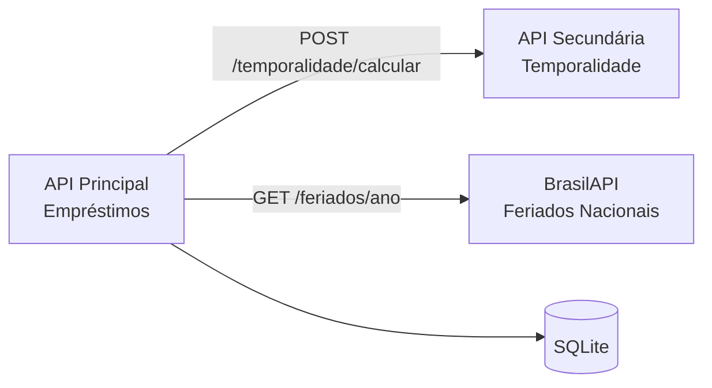

# API Principal - Empréstimo de Caixas de Documentos

API REST que gerencia o cadastro de caixas-arquivo e o controle de empréstimos internos dessas caixas a setores solicitantes, dentro de um sistema de gestão documental arquivística.

O problema que resolve: no ambiente de arquivo físico, não há hoje um sistema digital que registre quem pegou emprestada uma caixa, quando deve devolver — considerando automaticamente feriados e fins de semana — e qual o prazo de guarda documental daquela caixa segundo a legislação arquivística vigente.

Este MVP é uma continuidade do ArquivoDoc, sistema de controle de empréstimo de caixas desenvolvido na disciplina de Desenvolvimento Full Stack, agora evoluído para uma arquitetura de microsserviços.

Este componente é a API principal de uma arquitetura de 3 serviços independentes:



- **API Principal** (este repositório): gerencia caixas e empréstimos internos, persiste em SQLite
- **[API Secundária](https://github.com/anapoffo/mvp-api-temporalidade)**: calcula prazos de guarda documental
- **BrasilAPI (Feriados Nacionais)**: serviço externo público que ajusta automaticamente a data de devolução de um empréstimo, caso caia em feriado nacional ou fim de semana

## Tecnologias

- Python 3.12 + FastAPI
- SQLite (persistência)
- httpx (comunicação com a API secundária e com a BrasilAPI)
- Docker

## API Externa: BrasilAPI (Feriados Nacionais)

- **Link:** https://brasilapi.com.br/docs#tag/Feriados-Nacionais
- **Licença/cadastro:** serviço público gratuito, mantido por comunidade, sem necessidade de cadastro ou chave de API
- **Rota utilizada:** `GET https://brasilapi.com.br/api/feriados/v1/{ano}`
- **Uso:** ao registrar um empréstimo, a API consulta os feriados nacionais do ano da data de devolução prevista. Se essa data cair em um feriado ou fim de semana, ela é automaticamente avançada até o próximo dia útil, e o resultado é salvo no campo `data_devolucao_ajustada`. O retorno é tratado internamente pela aplicação, sem redirecionamento para outra página

## Instalação e execução local

```bash
git clone https://github.com/anapoffo/mvp-api-emprestimos.git
cd mvp-api-emprestimos
python -m venv venv
venv\Scripts\activate          # Windows
# source venv/bin/activate     # Linux/Mac
pip install -r requirements.txt
uvicorn main:app --reload --port 8000
```

Acesse a documentação interativa em `http://localhost:8000/docs`.

> **Importante:** esta API depende da API secundária de temporalidade rodando na porta 8001. Consulte o repositório [mvp-api-temporalidade](https://github.com/anapoffo/mvp-api-temporalidade) para instruções.

## Execução via Docker

```bash
docker compose up --build
```

Sobe a API principal (porta 8000) e a API secundária (porta 8001) juntas, conectadas pela rede interna do Docker.

## Rotas principais

| Método | Rota | Descrição |
|---|---|---|
| POST | `/caixas` | Cadastra uma caixa |
| GET | `/caixas` | Lista todas as caixas |
| GET | `/caixas/{id}` | Consulta uma caixa |
| PUT | `/caixas/{id}` | Atualiza uma caixa |
| DELETE | `/caixas/{id}` | Remove uma caixa |
| GET | `/caixas/{id}/temporalidade` | Consulta prazos de guarda (via API secundária) |
| POST | `/emprestimos` | Registra um empréstimo interno (ajusta data via BrasilAPI) |
| GET | `/emprestimos` | Lista empréstimos |
| GET | `/emprestimos/{id}` | Consulta um empréstimo |
| PUT | `/emprestimos/{id}/devolver` | Marca devolução |
| DELETE | `/emprestimos/{id}` | Cancela um empréstimo |

## Autora

Ana Poffo — Pós-graduação em Engenharia de Software, PUC-Rio
